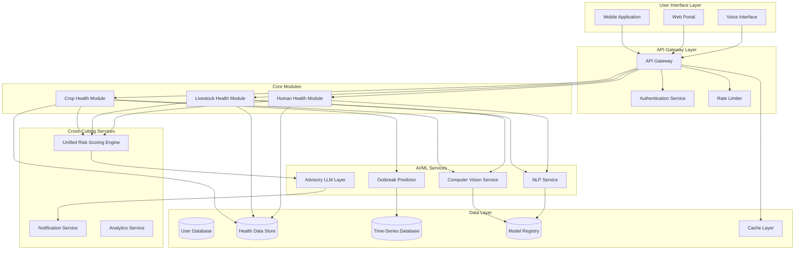

# Design Document: GramSwasthya AI Platform
This submission is prepared for AI for Bharat – Student Track.
Deployment is not included as per hackathon instructions.
The focus of this submission is system architecture, AI design, and scalable implementation strategy.
## Overview

GramSwasthya AI is a unified rural preventive bio-health intelligence platform that integrates three critical health domains: crop health, livestock health, and human health. The platform leverages state-of-the-art AI technologies including computer vision (CNN/Vision Transformers), natural language processing, and time-series forecasting to provide early detection, risk assessment, and preventive guidance across rural India.

The system is designed with a modular architecture that allows independent development and deployment of each health domain while maintaining a unified risk scoring engine that identifies cross-domain health correlations. The platform prioritizes accessibility through multilingual support, offline-first design, and voice-based interfaces suitable for low-literacy rural populations.

### Key Design Principles

1. **Modularity**: Each health domain (crop, livestock, human) operates as an independent module with well-defined interfaces
2. **Scalability**: Designed to handle millions of users across diverse rural regions with varying network conditions
3. **Accessibility**: Voice-based interfaces, multilingual support, and offline-first architecture
4. **Privacy**: End-to-end encryption, data anonymization, and user consent management
5. **Phased Deployment**: Incremental rollout allowing early validation and iterative improvement

## Architecture

### High-Level System Architecture



### Deployment Architecture

The platform supports three deployment modes:

1. **Cloud Deployment**: Full-featured deployment on cloud infrastructure (AWS/Azure/GCP)
2. **Edge Deployment**: Lightweight models deployed on edge devices for offline operation
3. **Hybrid Deployment**: Critical services on cloud with edge caching for offline resilience

### Technology Stack

- **Backend**: Python (FastAPI/Flask) for API services
- **Computer Vision**: PyTorch/TensorFlow with CNN (ResNet, EfficientNet) and Vision Transformers (ViT, Swin)
- **NLP**: Transformers library with multilingual models (mBERT, IndicBERT, XLM-R)
- **LLM Advisory**: OpenAI API / Anthropic Claude / Open-source LLMs (Llama, Mistral) with RAG
- **Time-Series Forecasting**: Prophet, LSTM, or Temporal Fusion Transformers
- **Database**: PostgreSQL (relational), MongoDB (document store), TimescaleDB (time-series)
- **Cache**: Redis for session management and response caching
- **Message Queue**: RabbitMQ/Kafka for asynchronous processing
- **Mobile**: React Native or Flutter for cross-platform mobile app
- **Monitoring**: Prometheus + Grafana for metrics, ELK stack for logging

## Components and Interfaces

### 1. Crop Health Module

**Responsibilities**:
- Image-based crop disease detection
- Weather-based outbreak prediction
- Yield loss estimation
- Village-level crop risk scoring

**Interfaces**:

```python
class CropHealthModule:
    def detect_disease(self, image: Image, crop_type: str, location: GeoLocation) -> DiseaseDetectionResult:
        """
        Analyzes crop image and returns disease classification with confidence.
        
        Args:
            image: Crop image (RGB, min 224x224)
            crop_type: Type of crop (rice, wheat, pulses, etc.)
            location: Geographic coordinates for context
            
        Returns:
            DiseaseDetectionResult containing:
                - disease_name: str
                - confidence: float (0-1)
                - severity: str (mild, moderate, severe)
                - treatment_recommendations: List[str]
                - image_quality_score: float
        """
        pass
    
    def predict_outbreak(self, village_id: str, forecast_days: int) -> OutbreakPrediction:
        """
        Predicts disease outbreak risk based on weather and historical data.
        
        Args:
            village_id: Unique village identifier
            forecast_days: Prediction window (7 or 14 days)
            
        Returns:
            OutbreakPrediction containing:
                - risk_level: str (low, medium, high, critical)
                - diseases_at_risk: List[str]
                - probability: float
                - yield_loss_estimate: float (percentage)
                - confidence_interval: Tuple[float, float]
        """
        pass
    
    def calculate_village_risk_score(self, village_id: str) -> VillageRiskScore:
        """
        Computes aggregated crop health risk score for a village.
        
        Args:
            village_id: Unique village identifier
            
        Returns:
            VillageRiskScore containing:
                - overall_score: float (0-100)
                - contributing_factors: Dict[str, float]
                - affected_area_hectares: float
                - priority_rank: int
                - last_updated: datetime
        """
        pass
```

**Internal Components**:
- **Image Preprocessor**: Handles image normalization, augmentation, quality assessment
- **Disease Classifier**: CNN or Vision Transformer for disease classification
- **Weather Integrator**: Fetches and processes weather data from external APIs
- **Outbreak Predictor**: Time-series model for disease outbreak forecasting
- **Yield Estimator**: Calculates potential yield loss based on disease severity and timing

### 2. Livestock Health Module

**Responsibilities**:
- Image-based livestock disease detection
- Voice-based symptom analysis
- Milk production anomaly detection
- Epidemic clustering detection

**Interfaces**:

```python
class LivestockHealthModule:
    def detect_disease_from_image(self, image: Image, animal_type: str) -> LivestockDiseaseResult:
        """
        Analyzes livestock image for visible disease symptoms.
        
        Args:
            image: Livestock image
            animal_type: Type of animal (cattle, buffalo, goat, poultry)
            
        Returns:
            LivestockDiseaseResult containing:
                - detected_symptoms: List[str]
                - possible_diseases: List[Tuple[str, float]]  # (disease, confidence)
                - severity: str
                - is_contagious: bool
                - recommendations: List[str]
        """
        pass
    
    def analyze_voice_symptoms(self, audio: AudioData, language: str) -> SymptomAnalysisResult:
        """
        Extracts and classifies symptoms from voice description.
        
        Args:
            audio: Audio recording of symptom description
            language: Regional language code (hi, bn, ta, te, mr)
            
        Returns:
            SymptomAnalysisResult containing:
                - transcription: str
                - extracted_symptoms: List[str]
                - confidence: float
                - clarification_needed: bool
                - follow_up_questions: List[str]
        """
        pass
    
    def detect_milk_anomaly(self, animal_id: str, production_data: ProductionRecord) -> AnomalyResult:
        """
        Detects anomalies in milk production indicating health issues.
        
        Args:
            animal_id: Unique animal identifier
            production_data: Recent milk production record
            
        Returns:
            AnomalyResult containing:
                - is_anomaly: bool
                - anomaly_score: float
                - baseline_production: float
                - current_production: float
                - possible_causes: List[str]
                - trend: str (declining, stable, improving)
        """
        pass
    
    def detect_epidemic_clusters(self, region_id: str, time_window_days: int) -> List[EpidemicCluster]:
        """
        Identifies geographic clusters of disease cases.
        
        Args:
            region_id: Region identifier (district/block)
            time_window_days: Time window for cluster analysis
            
        Returns:
            List of EpidemicCluster containing:
                - cluster_id: str
                - center_location: GeoLocation
                - radius_km: float
                - case_count: int
                - disease_type: str
                - risk_level: str
                - affected_villages: List[str]
        """
        pass
```

**Internal Components**:
- **Image Analyzer**: Computer vision model for livestock disease detection
- **Voice Processor**: Speech-to-text with regional language support
- **Symptom Extractor**: NLP model for symptom entity extraction
- **Production Tracker**: Time-series anomaly detection for milk production
- **Spatial Analyzer**: Geographic clustering algorithm (DBSCAN/HDBSCAN)

### 3. Human Health Module

**Responsibilities**:
- Voice-based symptom intake in regional languages
- Risk classification (Low/Moderate/High)
- Preventive advisory generation
- PHC referral management

**Interfaces**:

```python
class HumanHealthModule:
    def intake_symptoms(self, audio: AudioData, language: str, user_context: UserContext) -> SymptomIntakeResult:
        """
        Processes voice-based symptom description.
        
        Args:
            audio: Audio recording of symptoms
            language: Regional language code
            user_context: User demographics and history
            
        Returns:
            SymptomIntakeResult containing:
                - transcription: str
                - extracted_symptoms: List[Symptom]
                - duration: str
                - severity_indicators: List[str]
                - clarification_questions: List[str]
        """
        pass
    
    def classify_risk(self, symptoms: List[Symptom], user_context: UserContext) -> RiskClassification:
        """
        Classifies health risk based on symptoms.
        
        Args:
            symptoms: List of extracted symptoms with metadata
            user_context: User age, gender, medical history
            
        Returns:
            RiskClassification containing:
                - risk_level: str (Low, Moderate, High)
                - confidence: float
                - emergency_indicators: List[str]
                - reasoning: str
                - recommended_action: str
        """
        pass
    
    def generate_advisory(self, risk_classification: RiskClassification, language: str) -> HealthAdvisory:
        """
        Generates preventive health advisory in regional language.
        
        Args:
            risk_classification: Risk assessment result
            language: Target regional language
            
        Returns:
            HealthAdvisory containing:
                - advice_text: str
                - home_remedies: List[str]
                - dietary_recommendations: List[str]
                - warning_signs: List[str]
                - follow_up_timeline: str
        """
        pass
    
    def find_nearest_phc(self, location: GeoLocation, specialization: Optional[str]) -> PHCReferral:
        """
        Finds nearest PHC for high-risk cases.
        
        Args:
            location: User's geographic location
            specialization: Required medical specialization (optional)
            
        Returns:
            PHCReferral containing:
                - phc_name: str
                - distance_km: float
                - contact_info: ContactDetails
                - available_services: List[str]
                - transportation_guidance: str
                - referral_document: ReferralSummary
        """
        pass
```

**Internal Components**:
- **Voice Transcriber**: Multilingual speech-to-text engine
- **Symptom NLP**: Entity extraction and normalization
- **Risk Classifier**: ML model for risk stratification
- **Advisory Generator**: LLM-based advisory with RAG for medical knowledge
- **PHC Locator**: Geographic search with availability checking

### 4. Unified Risk Scoring Engine

**Responsibilities**:
- Compute unified risk scores across all three domains
- Identify cross-domain correlations
- Generate multi-domain intervention recommendations

**Interfaces**:

```python
class UnifiedRiskScoringEngine:
    def compute_unified_score(self, village_id: str) -> UnifiedRiskScore:
        """
        Computes unified risk score combining all health domains.
        
        Args:
            village_id: Unique village identifier
            
        Returns:
            UnifiedRiskScore containing:
                - overall_score: float (0-100)
                - crop_health_score: float
                - livestock_health_score: float
                - human_health_score: float
                - domain_weights: Dict[str, float]
                - risk_level: str
                - correlations: List[CrossDomainCorrelation]
        """
        pass
    
    def identify_correlations(self, region_id: str, time_window_days: int) -> List[HealthCorrelation]:
        """
        Identifies correlations between health domains.
        
        Args:
            region_id: Region identifier
            time_window_days: Analysis time window
            
        Returns:
            List of HealthCorrelation containing:
                - domain_pair: Tuple[str, str]
                - correlation_coefficient: float
                - significance: float
                - pattern_description: str
                - examples: List[str]
        """
        pass
    
    def recommend_interventions(self, unified_score: UnifiedRiskScore) -> InterventionPlan:
        """
        Generates multi-domain intervention recommendations.
        
        Args:
            unified_score: Unified risk assessment
            
        Returns:
            InterventionPlan containing:
                - priority_actions: List[Action]
                - resource_requirements: Dict[str, Any]
                - expected_impact: Dict[str, float]
                - timeline: str
                - stakeholders: List[str]
        """
        pass
```

### 5. Multilingual Advisory Layer

**Responsibilities**:
- Generate contextual advice using LLMs
- Maintain accuracy across languages
- Adapt to local practices and resources

**Interfaces**:

```python
class AdvisoryLayer:
    def generate_advice(self, context: AdvisoryContext, language: str) -> Advisory:
        """
        Generates contextual advice using LLM.
        
        Args:
            context: Context including domain, risk level, symptoms/issues
            language: Target regional language
            
        Returns:
            Advisory containing:
                - advice_text: str
                - action_items: List[str]
                - resources: List[Resource]
                - sources: List[str]
                - confidence: float
        """
        pass
    
    def validate_medical_accuracy(self, advice: str, domain: str) -> ValidationResult:
        """
        Validates medical/agricultural accuracy of generated advice.
        
        Args:
            advice: Generated advice text
            domain: Health domain (crop, livestock, human)
            
        Returns:
            ValidationResult containing:
                - is_valid: bool
                - accuracy_score: float
                - flagged_claims: List[str]
                - corrections: List[str]
        """
        pass
```

## Data Models

### Core Data Structures

```python
from dataclasses import dataclass
from datetime import datetime
from typing import List, Optional, Dict, Tuple
from enum import Enum

class RiskLevel(Enum):
    LOW = "low"
    MODERATE = "moderate"
    HIGH = "high"
    CRITICAL = "critical"

class HealthDomain(Enum):
    CROP = "crop"
    LIVESTOCK = "livestock"
    HUMAN = "human"

@dataclass
class GeoLocation:
    latitude: float
    longitude: float
    village_id: str
    district: str
    state: str

@dataclass
class Image:
    data: bytes
    format: str  # jpeg, png
    width: int
    height: int
    timestamp: datetime
    location: Optional[GeoLocation]

@dataclass
class AudioData:
    data: bytes
    format: str  # wav, mp3
    duration_seconds: float
    sample_rate: int
    timestamp: datetime

@dataclass
class Symptom:
    name: str
    severity: str  # mild, moderate, severe
    duration: str  # hours, days, weeks
    frequency: str  # constant, intermittent
    confidence: float

@dataclass
class DiseaseDetectionResult:
    disease_name: str
    confidence: float
    severity: str
    treatment_recommendations: List[str]
    image_quality_score: float
    timestamp: datetime

@dataclass
class OutbreakPrediction:
    risk_level: RiskLevel
    diseases_at_risk: List[str]
    probability: float
    yield_loss_estimate: float
    confidence_interval: Tuple[float, float]
    forecast_days: int
    timestamp: datetime

@dataclass
class VillageRiskScore:
    village_id: str
    overall_score: float  # 0-100
    contributing_factors: Dict[str, float]
    affected_area_hectares: float
    priority_rank: int
    last_updated: datetime

@dataclass
class RiskClassification:
    risk_level: RiskLevel
    confidence: float
    emergency_indicators: List[str]
    reasoning: str
    recommended_action: str
    timestamp: datetime

@dataclass
class UnifiedRiskScore:
    village_id: str
    overall_score: float
    crop_health_score: float
    livestock_health_score: float
    human_health_score: float
    domain_weights: Dict[str, float]
    risk_level: RiskLevel
    correlations: List['CrossDomainCorrelation']
    timestamp: datetime

@dataclass
class CrossDomainCorrelation:
    domain_pair: Tuple[HealthDomain, HealthDomain]
    correlation_coefficient: float
    significance: float
    pattern_description: str
    examples: List[str]

@dataclass
class PHCReferral:
    phc_name: str
    distance_km: float
    contact_info: 'ContactDetails'
    available_services: List[str]
    transportation_guidance: str
    referral_document: 'ReferralSummary'

@dataclass
class UserContext:
    user_id: str
    age: int
    gender: str
    location: GeoLocation
    medical_history: List[str]
    language_preference: str
```

### Database Schema

**Users Table**:
```sql
CREATE TABLE users (
    user_id UUID PRIMARY KEY,
    phone_number VARCHAR(15) UNIQUE NOT NULL,
    name VARCHAR(100),
    age INTEGER,
    gender VARCHAR(10),
    village_id VARCHAR(50),
    language_preference VARCHAR(5),
    created_at TIMESTAMP DEFAULT CURRENT_TIMESTAMP,
    last_active TIMESTAMP
);
```

**Crop Health Records**:
```sql
CREATE TABLE crop_health_records (
    record_id UUID PRIMARY KEY,
    user_id UUID REFERENCES users(user_id),
    image_url VARCHAR(500),
    crop_type VARCHAR(50),
    disease_detected VARCHAR(100),
    confidence FLOAT,
    severity VARCHAR(20),
    location GEOGRAPHY(POINT),
    created_at TIMESTAMP DEFAULT CURRENT_TIMESTAMP
);
```

**Livestock Health Records**:
```sql
CREATE TABLE livestock_health_records (
    record_id UUID PRIMARY KEY,
    user_id UUID REFERENCES users(user_id),
    animal_id VARCHAR(50),
    animal_type VARCHAR(50),
    symptoms TEXT[],
    diagnosis VARCHAR(100),
    is_contagious BOOLEAN,
    location GEOGRAPHY(POINT),
    created_at TIMESTAMP DEFAULT CURRENT_TIMESTAMP
);
```

**Human Health Records**:
```sql
CREATE TABLE human_health_records (
    record_id UUID PRIMARY KEY,
    user_id UUID REFERENCES users(user_id),
    symptoms TEXT[],
    risk_level VARCHAR(20),
    advisory_provided TEXT,
    phc_referred VARCHAR(100),
    created_at TIMESTAMP DEFAULT CURRENT_TIMESTAMP
);
```

**Village Risk Scores** (Time-Series):
```sql
CREATE TABLE village_risk_scores (
    village_id VARCHAR(50),
    timestamp TIMESTAMP,
    crop_score FLOAT,
    livestock_score FLOAT,
    human_score FLOAT,
    unified_score FLOAT,
    PRIMARY KEY (village_id, timestamp)
);
```


## Correctness Properties

A property is a characteristic or behavior that should hold true across all valid executions of a system—essentially, a formal statement about what the system should do. Properties serve as the bridge between human-readable specifications and machine-verifiable correctness guarantees.

### Crop Health Module Properties

**Property 1: Disease Classification Completeness**
*For any* crop image with sufficient quality, the disease detection function should return a result containing disease name, confidence score, severity level, and treatment recommendations.
**Validates: Requirements 1.1, 1.3**

**Property 2: Field-Level Aggregation Consistency**
*For any* set of images from the same field, the aggregated diagnosis should consider all individual detections and produce a field-level result that reflects the most severe or prevalent disease.
**Validates: Requirements 1.4**

**Property 3: Outbreak Alert Generation**
*For any* weather pattern classified as high-risk, the outbreak predictor should generate village-level alerts for all affected villages.
**Validates: Requirements 2.1, 2.3**

**Property 4: Yield Loss Estimation**
*For any* outbreak prediction with risk level above threshold, the system should include a yield loss percentage estimate.
**Validates: Requirements 2.5**

**Property 5: Village Risk Score Ranking**
*For any* set of villages with computed risk scores, the ranking should be in descending order by overall score.
**Validates: Requirements 3.4**

**Property 6: Daily Risk Score Updates**
*For any* village with new disease detection or weather data, the risk score should be recomputed within 24 hours.
**Validates: Requirements 3.3**

### Livestock Health Module Properties

**Property 7: Multi-Modal Evidence Combination**
*For any* livestock case where both image and voice inputs are provided, the diagnosis should incorporate evidence from both sources and indicate which symptoms came from which source.
**Validates: Requirements 4.3**

**Property 8: Contagious Disease Flagging**
*For any* livestock disease detection where the disease is classified as contagious, the result should include an epidemic monitoring flag set to true.
**Validates: Requirements 4.5**

**Property 9: Milk Production Anomaly Detection**
*For any* animal with established baseline production, when daily production drops more than 20% below baseline, an anomaly should be detected and flagged.
**Validates: Requirements 5.1, 5.3**

**Property 10: Production Trend Availability**
*For any* animal with at least 30 days of production data, the system should provide both 30-day and 90-day trend analyses.
**Validates: Requirements 5.5**

**Property 11: Epidemic Cluster Identification**
*For any* region where 3 or more cases of the same disease occur within 5km radius within 7 days, an epidemic cluster should be identified.
**Validates: Requirements 6.1**

**Property 12: Cluster Notification**
*For any* detected epidemic cluster, notifications should be generated for veterinary authorities and all farmers within the cluster radius.
**Validates: Requirements 6.3**

**Property 13: Cluster Evolution Tracking**
*For any* epidemic cluster, the system should maintain historical data showing case count, radius, and risk level over time.
**Validates: Requirements 6.4**

**Property 14: Epidemic Spread Risk Estimation**
*For any* epidemic cluster, a spread risk score should be computed based on cluster size, disease type, and population density.
**Validates: Requirements 6.5**

### Human Health Module Properties

**Property 15: Multilingual Voice Symptom Extraction**
*For any* voice input in a supported regional language (Hindi, Bengali, Tamil, Telugu, Marathi), the NLP engine should transcribe the audio and extract symptom entities with confidence scores.
**Validates: Requirements 7.1, 13.1**

**Property 16: Low Confidence Clarification**
*For any* symptom transcription with confidence below 70%, the system should generate clarifying questions to improve accuracy.
**Validates: Requirements 7.3**

**Property 17: Voice Data Privacy**
*For any* voice input processed by the system, the raw audio data should not be persisted in storage after symptom extraction is complete.
**Validates: Requirements 7.5**

**Property 18: Risk Classification Completeness**
*For any* set of extracted symptoms, the risk classification should return a risk level (Low, Moderate, or High), confidence score, reasoning, and recommended action.
**Validates: Requirements 8.1, 8.5**

**Property 19: High Risk PHC Referral**
*For any* risk classification with level "High", the result should include PHC referral information with location, contact details, and referral document.
**Validates: Requirements 8.3, 10.1**

**Property 20: Emergency Symptom Identification**
*For any* symptom set containing emergency indicators (chest pain, difficulty breathing, severe bleeding, altered consciousness), the system should flag them explicitly and classify risk as High.
**Validates: Requirements 8.4**

**Property 21: Preventive Advisory Generation**
*For any* risk classification of Low or Moderate, the advisory should include home remedies, dietary recommendations, and warning signs in the user's chosen language.
**Validates: Requirements 9.1, 9.2, 9.3**

**Property 22: Persistent Symptom Escalation**
*For any* user with symptoms recorded for more than 7 days without improvement, the system should recommend medical consultation regardless of initial risk level.
**Validates: Requirements 9.4**

**Property 23: PHC Referral Completeness**
*For any* high-risk case requiring referral, the system should provide PHC location, contact information, referral summary document, and transportation guidance.
**Validates: Requirements 10.1, 10.3, 10.5**

**Property 24: PHC Ranking by Distance**
*For any* location with multiple PHCs available, the referral list should be ranked by distance with the nearest PHC listed first.
**Validates: Requirements 10.4**

### Unified Risk Scoring Properties

**Property 25: Multi-Domain Risk Score Computation**
*For any* village with data from at least two health domains (crop, livestock, human), a unified risk score should be computed combining all available domain scores.
**Validates: Requirements 11.1**

**Property 26: Cross-Domain Correlation Detection**
*For any* region with sufficient historical data across multiple domains, the system should identify and report correlations with statistical significance above 0.5.
**Validates: Requirements 11.2**

**Property 27: Multi-Domain Intervention Recommendations**
*For any* unified risk score exceeding 75 (on 0-100 scale), the system should generate intervention recommendations addressing all contributing domains.
**Validates: Requirements 11.3**

### NLP and Language Processing Properties

**Property 28: Symptom Normalization**
*For any* extracted symptom in regional language, the NLP engine should map it to standardized medical terminology in the medical ontology.
**Validates: Requirements 13.2, 13.4**

**Property 29: Negation and Temporal Handling**
*For any* symptom description containing negations ("not", "no longer") or temporal qualifiers ("since yesterday", "for 3 days"), the extracted symptoms should correctly reflect these modifiers.
**Validates: Requirements 13.3**

### Forecasting and Prediction Properties

**Property 30: Confidence Interval Inclusion**
*For any* outbreak prediction, the result should include confidence intervals indicating the range of uncertainty in the forecast.
**Validates: Requirements 14.3**

**Property 31: Model Retraining Trigger**
*For any* prediction model where validation accuracy drops below 75%, the system should trigger automatic model retraining.
**Validates: Requirements 14.4**

### Advisory Layer Properties

**Property 32: Source Citation**
*For any* advisory containing medical or agricultural facts, reliable sources should be cited when available.
**Validates: Requirements 15.4**

### Scalability and Offline Properties

**Property 33: Offline Functionality**
*For any* core operation (disease detection, symptom extraction, risk classification), the system should function without internet connectivity using cached models and data.
**Validates: Requirements 16.2**

**Property 34: Data Synchronization**
*For any* data created while offline, when connectivity is restored, the data should automatically synchronize to the central database within 5 minutes.
**Validates: Requirements 16.4**

### Modularity Properties

**Property 35: Module Independence**
*For any* module update or failure, the other modules should continue functioning without degradation.
**Validates: Requirements 17.2**

**Property 36: Standardized Data Formats**
*For any* inter-module communication, the data should conform to the standardized schema defined in the API specification.
**Validates: Requirements 17.4**

### Security and Privacy Properties

**Property 37: Data Encryption**
*For any* personal health data (symptoms, diagnoses, user information), the data should be encrypted both in transit (TLS 1.3) and at rest (AES-256).
**Validates: Requirements 18.1**

**Property 38: Training Data Anonymization**
*For any* data used for model training or research, all personally identifiable information (name, phone, exact location) should be removed or anonymized.
**Validates: Requirements 18.2**

**Property 39: Consent Collection**
*For any* new user or data collection operation, explicit consent should be obtained and recorded before proceeding.
**Validates: Requirements 18.3**

**Property 40: Data Deletion**
*For any* user data deletion request, all associated personal data should be removed from all databases within 30 days.
**Validates: Requirements 18.4**

### Monitoring and Analytics Properties

**Property 41: Model Accuracy Tracking**
*For any* AI model in production, accuracy metrics should be computed and logged at least daily.
**Validates: Requirements 20.1**

**Property 42: Performance Metrics Collection**
*For any* API endpoint, latency, throughput, and error rate metrics should be collected and available for monitoring.
**Validates: Requirements 20.2**

**Property 43: Usage Analytics Generation**
*For any* 24-hour period, the system should generate analytics including active user count, queries per module, and geographic distribution.
**Validates: Requirements 20.3**

**Property 44: Health Impact Tracking**
*For any* detection, referral, or intervention, the system should record it for impact analysis including early detection count, referral count, and outcome tracking.
**Validates: Requirements 20.4**

## Error Handling

### Error Categories and Strategies

**1. Input Validation Errors**
- **Image Quality Issues**: When image quality is insufficient (blurry, poor lighting, wrong subject), return error with specific guidance on how to capture a better image
- **Audio Quality Issues**: When voice input is unclear or noisy, request re-recording with guidance on reducing background noise
- **Invalid Parameters**: When API parameters are missing or invalid, return 400 Bad Request with clear error message

**2. Model Inference Errors**
- **Low Confidence Predictions**: When model confidence is below threshold (e.g., <60%), flag the result as uncertain and request additional input or human review
- **Model Unavailable**: When model service is down, fall back to cached results or simpler rule-based classification with appropriate warning
- **Timeout Errors**: When inference takes too long (>30 seconds), return timeout error and suggest retrying with smaller input

**3. Data Access Errors**
- **Database Connection Failures**: Implement retry logic with exponential backoff (3 retries, max 10 seconds)
- **Missing Data**: When required historical data is unavailable, use default values or skip optional features gracefully
- **Data Corruption**: Validate data integrity on read; if corrupted, log error and use fallback data source

**4. External Service Errors**
- **Weather API Failures**: Cache recent weather data; use cached data if API is unavailable
- **LLM API Failures**: Fall back to template-based advisory generation if LLM service is unavailable
- **Notification Service Failures**: Queue notifications for retry; alert administrators if queue grows beyond threshold

**5. Resource Constraint Errors**
- **Memory Limits**: Implement batch processing for large datasets; process in chunks if memory is insufficient
- **Storage Limits**: Implement data retention policies; archive old data when storage reaches 80% capacity
- **Rate Limits**: Implement request throttling; return 429 Too Many Requests with retry-after header

### Error Response Format

All errors should follow a consistent JSON format:

```json
{
  "error": {
    "code": "ERROR_CODE",
    "message": "Human-readable error message",
    "details": {
      "field": "specific_field_name",
      "reason": "detailed explanation"
    },
    "suggestion": "What the user should do to resolve",
    "timestamp": "2024-01-15T10:30:00Z",
    "request_id": "unique-request-id"
  }
}
```

### Graceful Degradation

The system should degrade gracefully when components fail:

1. **Offline Mode**: Core functionality (disease detection, symptom extraction) works offline with cached models
2. **Reduced Accuracy Mode**: If primary model fails, use simpler backup model with accuracy warning
3. **Partial Results**: Return partial results when some components fail (e.g., disease detection without yield estimate)
4. **Manual Fallback**: For critical operations, provide manual override or human-in-the-loop option

### Logging and Monitoring

All errors should be logged with:
- Error type and severity (INFO, WARNING, ERROR, CRITICAL)
- Stack trace for debugging
- User context (anonymized user ID, location, language)
- Request parameters (sanitized to remove PII)
- Timestamp and request ID for tracing

Critical errors should trigger alerts to the operations team.

## Testing Strategy

### Dual Testing Approach

The GramSwasthya AI platform requires comprehensive testing using both unit tests and property-based tests:

**Unit Tests**: Focus on specific examples, edge cases, and integration points
- Specific disease detection examples with known images
- Edge cases like empty inputs, malformed data, boundary conditions
- Integration between modules (e.g., risk engine consuming module outputs)
- Error handling scenarios

**Property-Based Tests**: Verify universal properties across all inputs
- Test properties with randomized inputs (images, voice data, symptoms)
- Ensure properties hold for at least 100 iterations per test
- Cover the full input space rather than specific examples
- Catch unexpected edge cases through randomization

Both approaches are complementary and necessary for comprehensive coverage.

### Testing Framework Selection

**Python Backend**:
- **Unit Testing**: pytest with fixtures for test data
- **Property-Based Testing**: Hypothesis library
- **Integration Testing**: pytest with docker-compose for service dependencies
- **API Testing**: pytest with requests library

**Computer Vision Models**:
- **Unit Testing**: Test specific images with known labels
- **Property-Based Testing**: Generate synthetic images with known characteristics
- **Model Evaluation**: Separate validation set with ground truth labels

**NLP Models**:
- **Unit Testing**: Test specific symptom descriptions
- **Property-Based Testing**: Generate random symptom combinations
- **Language Testing**: Test all supported regional languages

### Property-Based Test Configuration

Each property test must:
- Run minimum 100 iterations (due to randomization)
- Use appropriate generators for input data (images, audio, text, numbers)
- Include a comment tag referencing the design property
- Tag format: `# Feature: gramswasthya-ai-platform, Property {number}: {property_text}`

Example property test structure:

```python
from hypothesis import given, strategies as st
import pytest

# Feature: gramswasthya-ai-platform, Property 1: Disease Classification Completeness
@given(
    image=st.images(min_width=224, min_height=224),
    crop_type=st.sampled_from(['rice', 'wheat', 'pulses']),
    location=st.geo_locations()
)
def test_disease_classification_completeness(image, crop_type, location):
    """
    For any crop image with sufficient quality, the disease detection function
    should return a result containing disease name, confidence score, severity
    level, and treatment recommendations.
    """
    result = crop_health_module.detect_disease(image, crop_type, location)
    
    assert result.disease_name is not None
    assert 0.0 <= result.confidence <= 1.0
    assert result.severity in ['mild', 'moderate', 'severe']
    assert len(result.treatment_recommendations) > 0
    assert result.image_quality_score >= 0.6  # Sufficient quality threshold
```

### Test Data Strategy

**Synthetic Data Generation**:
- Generate synthetic crop/livestock images using GANs or image augmentation
- Create synthetic voice data for symptom descriptions
- Generate realistic weather patterns and disease outbreak scenarios

**Real Data Collection**:
- Collect labeled images from agricultural universities and research centers
- Record voice samples from native speakers in all supported languages
- Gather historical disease and weather data from government sources

**Data Augmentation**:
- Apply transformations to images (rotation, scaling, color adjustment)
- Add noise to audio samples to test robustness
- Create variations of symptom descriptions with synonyms and dialects

### Integration Testing

Test inter-module communication:
- Crop module → Risk engine → Advisory layer
- Livestock module → Epidemic clustering → Notification service
- Human health module → Risk classification → PHC referral

### Performance Testing

- **Load Testing**: Simulate 10,000 concurrent users per district
- **Latency Testing**: Ensure API response times <2 seconds for 95th percentile
- **Throughput Testing**: Verify system can handle 1000 requests/second
- **Offline Testing**: Verify offline functionality with no network connectivity

### Security Testing

- **Penetration Testing**: Test for common vulnerabilities (SQL injection, XSS, CSRF)
- **Encryption Testing**: Verify all sensitive data is encrypted
- **Authentication Testing**: Test access control and authorization
- **Privacy Testing**: Verify PII is properly anonymized in training data

### Acceptance Testing

Each phase deployment should undergo field testing:
- **Phase 1**: Test crop health module with 100 farmers across 5 villages
- **Phase 2**: Add livestock module and test with 50 livestock owners
- **Phase 3**: Add human health module and test with 200 rural residents
- **Phase 4**: Test unified risk scoring with district health officials

### Continuous Testing

- **CI/CD Pipeline**: Run all tests on every commit
- **Automated Regression Testing**: Run full test suite nightly
- **Model Monitoring**: Continuously monitor model accuracy in production
- **A/B Testing**: Test new models against baseline before full deployment

### Test Coverage Goals

- **Code Coverage**: Minimum 80% line coverage for all modules
- **Property Coverage**: All 44 correctness properties must have corresponding property tests
- **Language Coverage**: All 5 regional languages must be tested
- **Device Coverage**: Test on both high-end and low-end mobile devices
